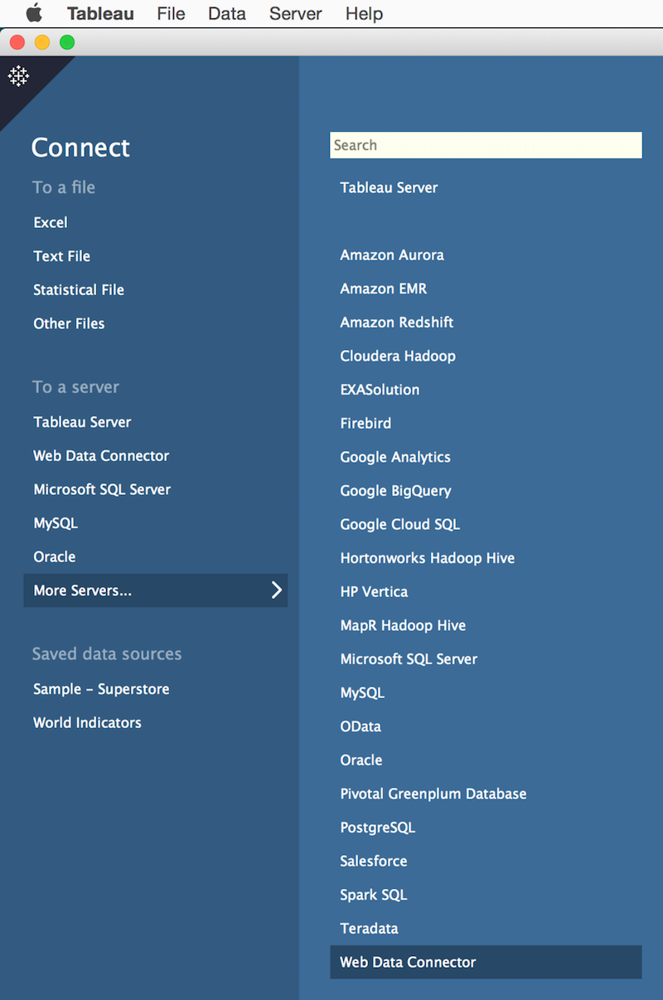
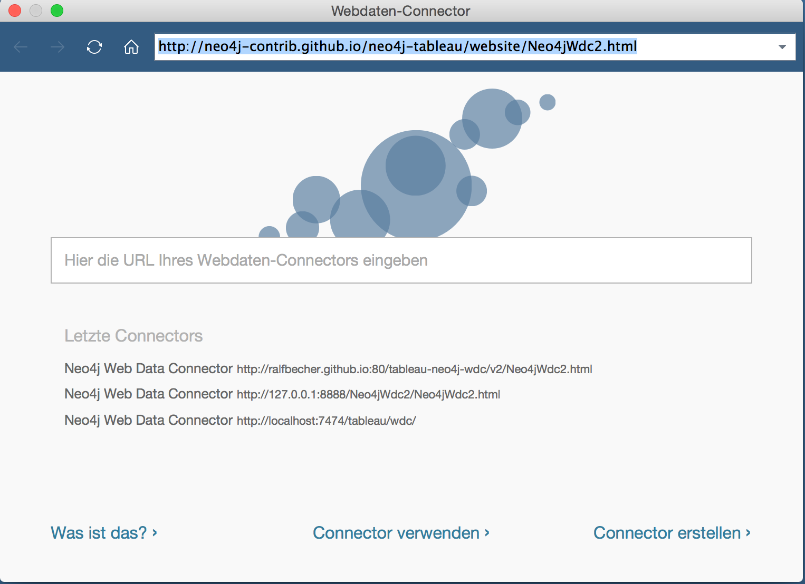
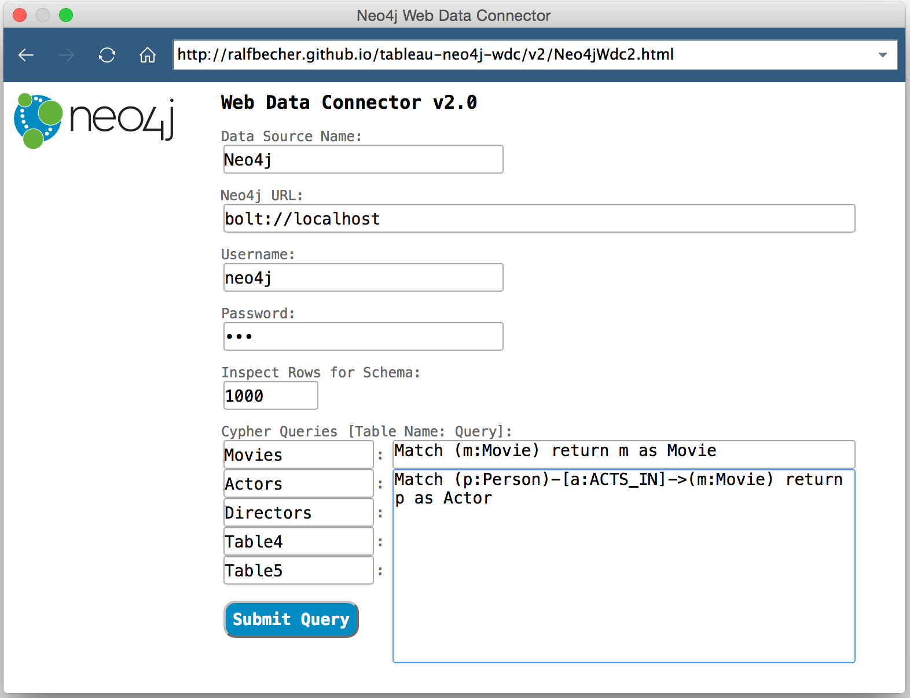
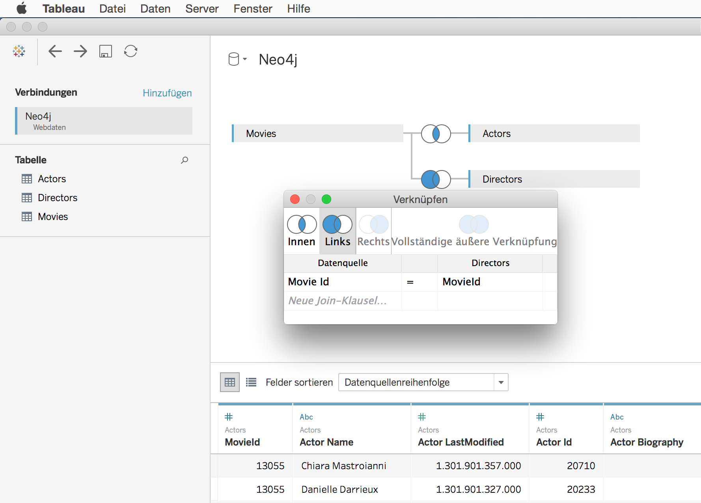
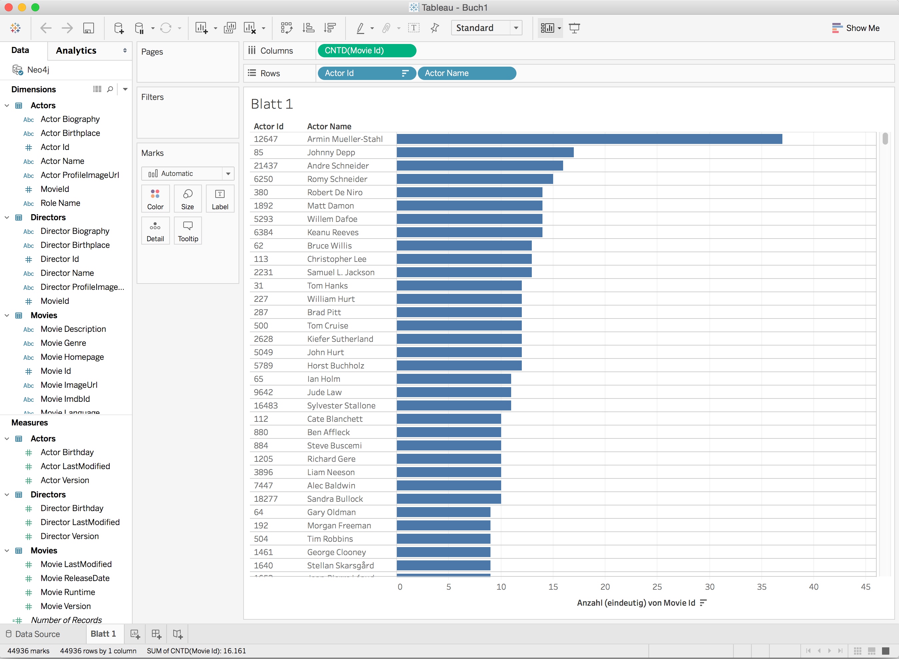

= Neo4j - Tableau Integration

== Neo4j Tableau Web Data Connector v2.0

Since Tableau 9.1 the Web Data Connector SDK can be used to connect Tableau to any web data accessible over HTTP. You can follow the WDC Tutorial to read about the details here:

https://tableau.github.io/webdataconnector

This Neo4j Tableau WDC implements WDC version 2.1.2 and can be used with Tableau v10.1 or later and Neo4j v3.0.4 or later:

https://tableau.github.io/webdataconnector/docs/wdc_library_versions

The Neo4j WDC uses the Neo4j Driver for Javascript which implements the https://en.wikipedia.org/wiki/Bolt_%28network_protocol%29[Bolt] network protocol:

https://github.com/neo4j/neo4j-javascript-driver

The Neo4j WDC v2.0 can be used directly via GitHub Page URL:

http://neo4j-contrib.github.io/neo4j-tableau/website/Neo4jWdc2.html (copy URL)

=== Connect from Tableau

Start Tableau Desktop and choose to connect a Web Data Connector:



Enter the URL of the hosted Neo4jWdc2.html page in the selection popup:



Now the Neo4jWdc2 form appears. The WDC consists of a HTML page including a form and JavaScript code to leverage the Tableau WDC API and to processes up to five Cypher queries against Neo4j. The result sets will be converted into tables and then passed into the Tableau workbook.



=== Connector Parameters

. **Data Source Name**: the name for the data source in the Tableau Workbook
. **Neo4j URL**: URL to connect a Neo4j server, usually ```bolt://<server>``` when default Bolt port or ```bolt://<server>:<port>```
. **Username/Password**: authentication credentials
. **Inspect Rows for Schema**: number of sample rows (default: 1000) to inspect JSON result set (can contain complex objects) 
from Cypher queries for used properties, important to build the table schema with columns for Tableau; set to 1 when first 
row includes all properties
. **Cypher Queries**: a list to add up to 5 Cypher queries for execution; use a table name per query in left column; 
tables can then be joined in Tableau data wizard later

The resulting tables can be prepared in the Tableau data wizard:



After all queries are executed the created and loaded *Tableau Workbook* will appear and shows the data source: *Neo4j*, the name we’ve entered, and the dimensions and measures from the Cypher queries' result sets.



Now we can easily start analyzing the Data from Neo4j:

== TDE File Generator Extension

We also provide a Neo4j Server extension to generate TDE files to be used with Tableau Desktop and Server.

*Read more about that approach in link:./documentation/tde-file-generation.adoc[our documentation].*

=== Create TDE file via GET request

To create a TDE from the results of a Neo4j Cypher query, pass for instance the following query:

[source,cypher]
----
MATCH (n:Movie) RETURN n
----

To this URL: `http://localhost:7474/export/tableau/tde/MATCH%20(n%3AMovie)%20RETURN%20n`

It will generate and return a TDE file as download for usage in Tableau.

=== Create TDE file via POST request

You can use same endpoint to pass a POST request and upload a text file (ASCII) containing one Cypher query:

----
curl -H "Content-Type: text/plain" -X POST --user neo4j:neo4j --data-ascii @/Users/username/Desktop/cypher-query.txt -o result.tde http://localhost:7474/export/tableau/tde
----

The resulting TDE file specified with option `-o outputfile` is then stored locally.

== Versions

* This code has been tested on Neo4j 3.0 versions. 
* This code has been tested against Tableau 10.1.
* The TDE format should be able to be read by Tableau versions 7 and higher.
