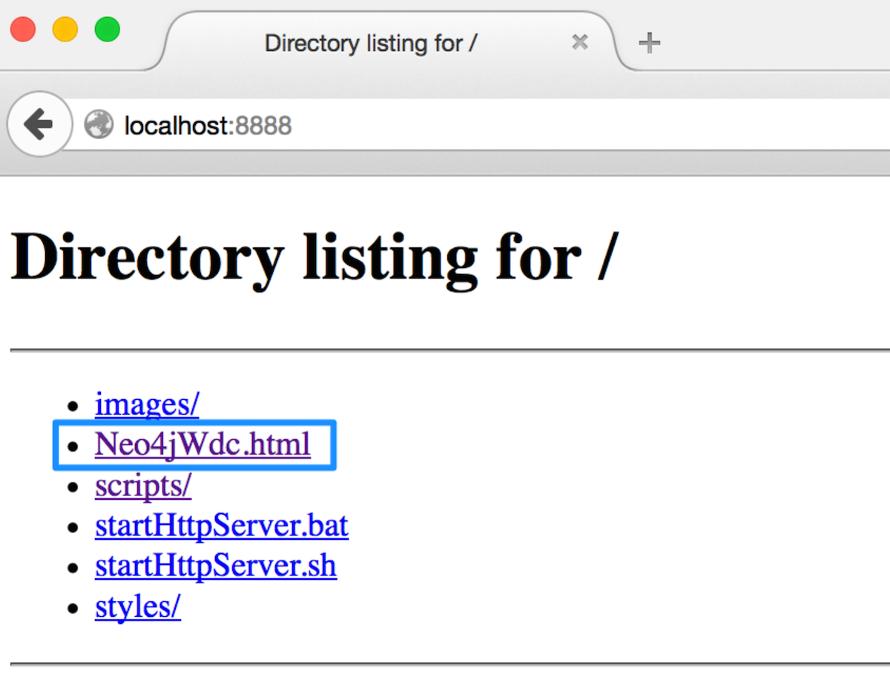
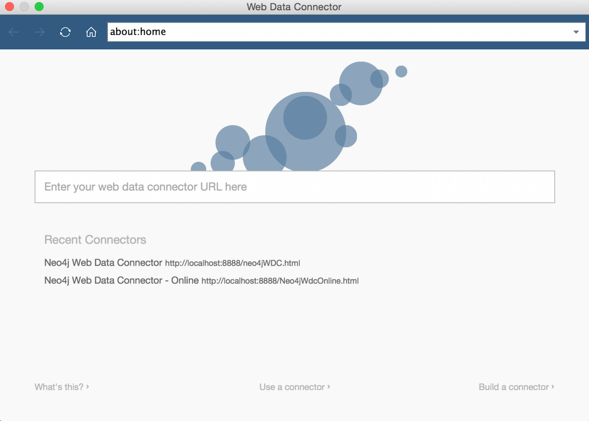
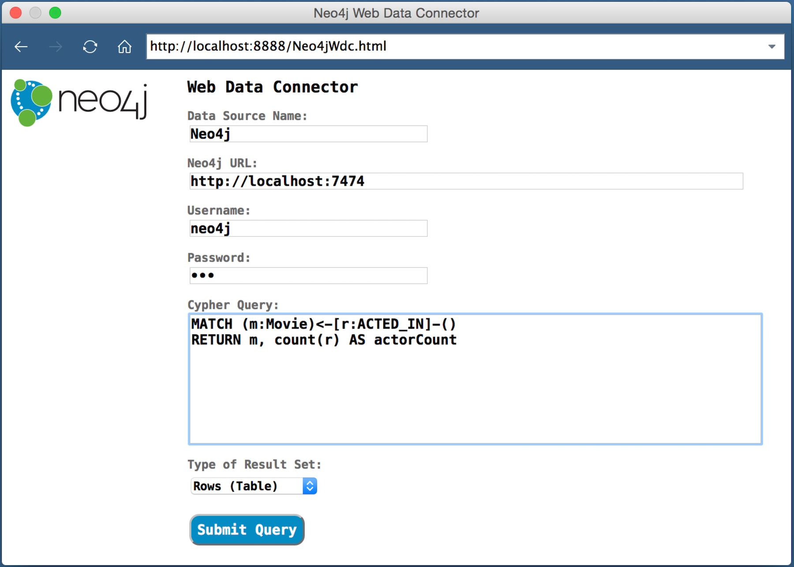
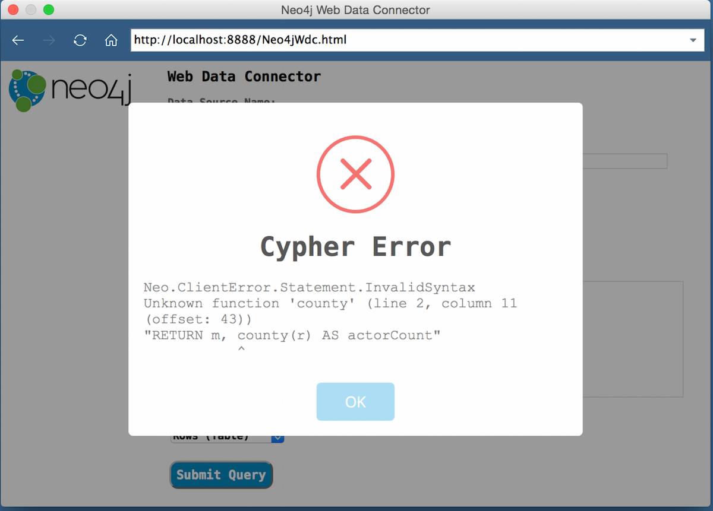
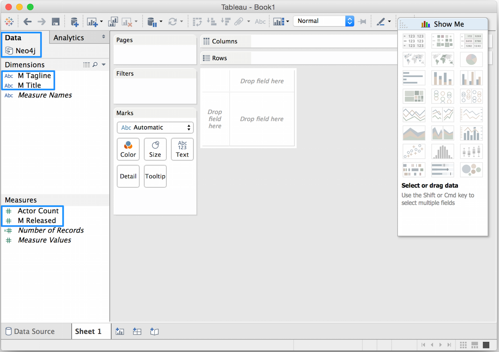
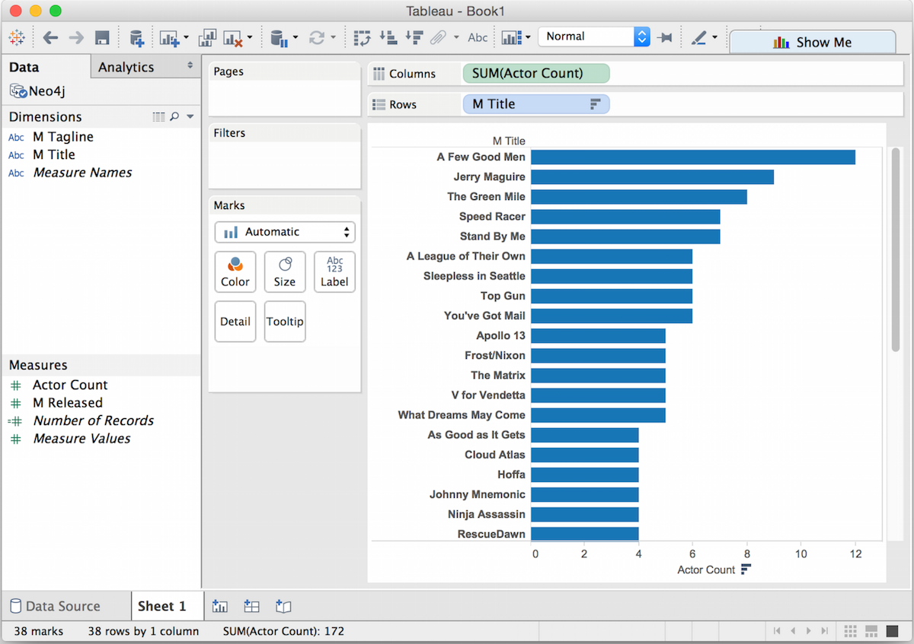
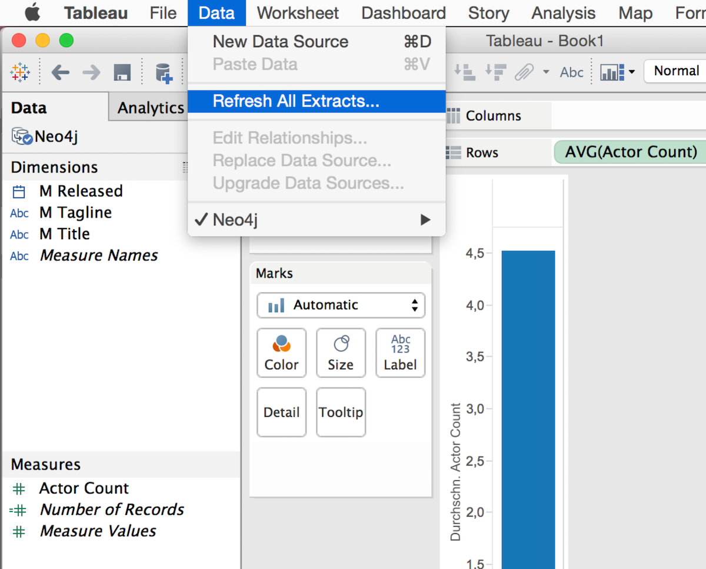
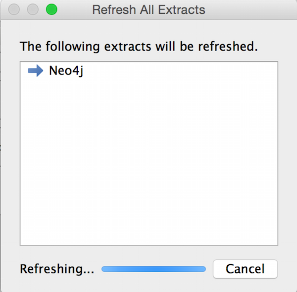
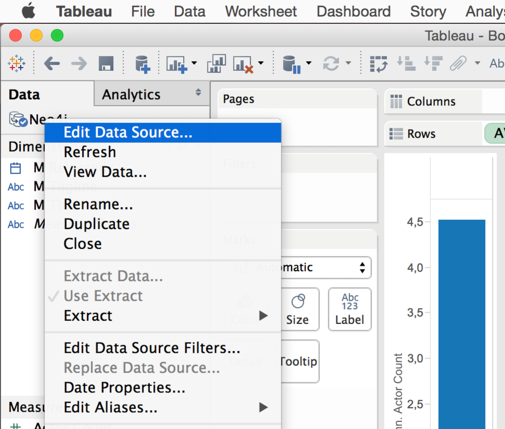
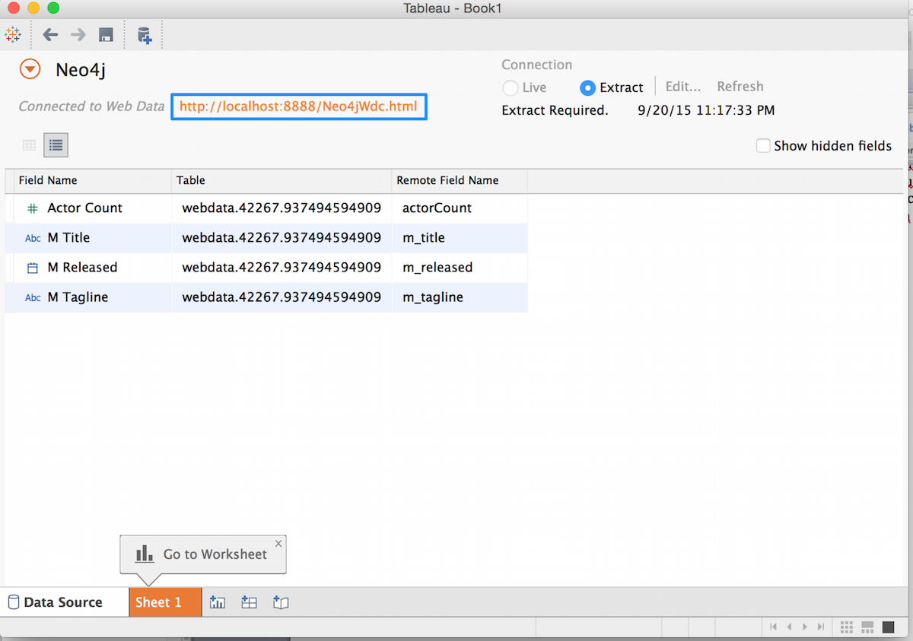

= Tableau 9.1 Web Data Connector (WDC) for Neo4j

== Prerequisites

Tableau 9.1 includes the Web Data Connector SDK, which lets you connect to any web data accessible over HTTP. You can follow the WDC Tutorial to read about the details: http://onlinehelp.tableau.com/current/api/wdc/en-us/help.htm

The WDC for Neo4j consists of a HTML page including a form and JavaScript code to leverage the Tableau WDC API and to process Cypher queries against Neo4j Transactional HTTP API via Ajax call. 
The JSON result set will be converted into a table and then passed into the Tableau workbook. 

The get this working the HTML page Neo4jWdc.html and it’s linked content (scripts, styles etc.) needs to be published to a web server. For a local use you can just start a simple HTTP server with Python (https://www.python.org/) from the same folder:

----
python -m SimpleHTTPServer 8888     	// for Python 2.7
python3 -m http.server 8888		// for Python 3 and above
----

We also provide this as an hosted version on GitHub as GitHub pages. http://neo4j-contrib.github.io/neo4j-tableau/website/Neo4jWdc.html[Open this link to see it in action.]

== Usage

=== Connect from Tableau

Start Tableau Desktop 9.1 and choose to connect a WDC (Web Data Connector):

image::img/image003.png[width=400]

The WDC selection popup window appears. Enter the URL of your WDC. It lists previously used WDC URLs below you can choose by click:

=== Connection Settings

Enter the URL for Neo4jWdc: http://localhost:8888/Neo4jWdc.html

Now the Neo4jWdc Form appears. 

Enter your 

* data source name, 
* Neo4j URL, 
* login credentials
* and Cypher Query to process
* optional choose result set type

After hitting "Submit Query" button a connect to Neo4j is made and the Cypher query will be executed. 

=== Error Messages

If something fails you will get an error message:

image::img/image009.png[width=500]

An *Ajax Error* occurs if URL or credentials are wrong or something happened during the network communication with the database.

A *Cypher Error* if your query syntax is wrong.

== Using Neo4j Cypher Results in Tableau Workbook

After query execution the created and loaded *Tableau Workbook* will appear and shows the data source or extract: Neo4j, the name we’ve entered,  and the dimensions and measures from the Cypher query result set. Please note that JSON properties are un-nested into fields and numerical values are already casted to measures out of the JSON from Neo4j result.

Now we can easily start analyzing the Data from Neo4j:

=== Refreshing Workbook Data

If data has been changed in the Neo4j database you might want to update your Tableau Workbook. In this case go to the Menu _Data/Refresh All Extracts_:

Then click the _Refresh_ button. The data refreshing will be executed like this:

=== Saving the Workbook

If you save and close the *Tableau Workbook* all connection details except the login credentials will be stored inside. If you re-open the Workbook and then want to refresh the data you have to re-enter your credentials! Do right-click the *data source* (Neo4j in this case) and choose _Edit Data Source_. 

Then, the Tableau *Import Wizzard* appears and shows the *link* to the Neo4jWdc page. Click the URL and the Neo4jWdc Form will re-appear with all stored properties. Then you can re-enter username/password and click _Submit Query_ to retrieve the new data:

== Run Neo4j WDC as Server Extension

Download/build and install the extension(s) according to the instructions in the link:../README.adoc[readme] into the server’s plugins directory. 

----
cp extension/jars/neo4j-web-extension-tableau-wdc-1.0.0.jar $NEO4J_HOME/plugins/ 
----

Edit `conf/neo4j.conf` to register the package name with an endpoint:

----
org.neo4j.server.thirdparty_jaxrs_classes=org.neo4j.tableau.wdc=/tableau/wdc
----

For the moment, the extension works only with disabled authentication:

----
dbms.security.auth_enabled=false
----

Restart the server:

----
$NEO4J_HOME/bin/neo4j restart
----

Then navigate in browser to the extension URL to start the Neo4j WDC Form: http://localhost:7474/tableau/wdc/
